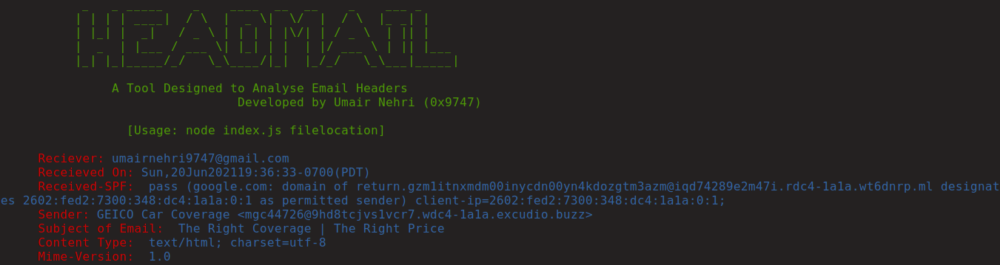

<h1 align="center">
<a href="https://github.com/umair9747/headmail/"></a>
  <br>
  
  
  
  
  
  
  
  <br>
  
</h1>

<h2 align="left">
  <b>About HeadMail</b>
</h2>

<h1 align="center">

  </h1>
  
<p align="left">
  HeadMail is an cross-platform tool developed using Nodejs which can help investigators and researchers to analyse email headers to filter out relevant data
  which can be considered useful during digital investigations.
 </p>

<h2 align="left">
  <b>Headers Filtered:</b>
  </h2>
  
  <p align="left">
     <ul type="disc">
       <li>Delivered-To</li>
       <li>From</li>
       <li>Date & Time</li>
       <li>Subject</li>
       <li>Received-SPF</li>
       <li>Content-Type</li>
       <li>Message-ID</li>
       <li>Mime-Version</li>
       <li>X-Mailer</li>
       </ul>
  </p>
  
 <h2 align="left">
  <b>Support</b>
 </h2>
 
| Windows | Linux | Mac | Termux |
| ------- | ----- | --- | ------ |
| ✔ | ✔ | ✔ | ✔ |

✔ - Tested  <br/>
❔ - Not tested <br/>

<h2 align="left">
  <b>Installation</b>
</h2>

<h3 align="left">
  <b>Windows</b>
</h3>

<p align="left">
  <b>Note: </b><br>
  <ul type="disc">
    <li>Make sure you have Nodejs installed on your system, which you can do by going to https://nodejs.org/en/download/</li>
    <li>Clone / Download the repository to your local machine and run the following commands:</li>
   </ul>
   
   ```sh
   cd headmail
   npm i
   node index.js
   ```
  </p>
  
<h3 align="left">
  <b>Linux / Termux</b>
</h3>

<p align="left">
  
 ```sh
    sudo apt-get update -y && sudo apt-get upgrade -y
    sudo apt-get install nodejs -y
    sudo apt-get install git -y
    git clone https://github.com/umair9747/headmail
    cd headmail
    npm i
    node index.js
  ```
</p>

<h2 align="left">
  <b>Usage</b>
</h2>

<p align="left">
  
 ```sh
    Headmail V1.0
     Usage: node index.js filelocation
  
     FILENAME --
     Specifies the location of the file containing the email headers that the tool would read.
  
     Example Usage: node index.js /home/umair/Desktop/headers.txt
  ```
  <b>NOTE: Supplying a file is mandatory else Archer would return an error</b>
</p>


 <h2 align="left">
  <b>Wlling to Contribute?</b>
 </h2>

<p align="left">
  You can make a contribution to this repo by creating a pull request! Make sure you include the following details:
  <ul type="disc">
    <li> Feature introduced</li>
    <li> What does the feature do? </li>
    <li> List of External Modules/Packages if used </li>
    </ul>
  </p>
  
  <h2 align="left">
  <b>Reach Out!</b>
 </h2>

<p align="left">
  You can contact me through the following handles:
  <ul type="disc">
    <li> <b>Instagram</b> - @umairnehri</li>
    <li> <b>Twitter</b> - @0x9747</li>
    <li> <b>Discord</b> - Umair#5710 </li>
    <li> <b>Email</b> - 0x9778@protonmail.com </li>
    </ul>
  </p>
